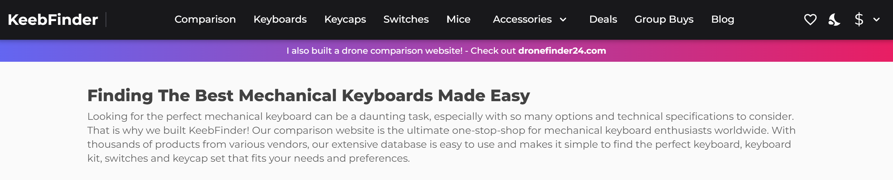
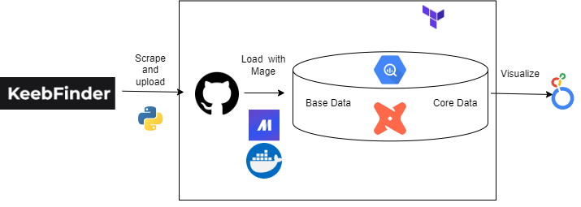
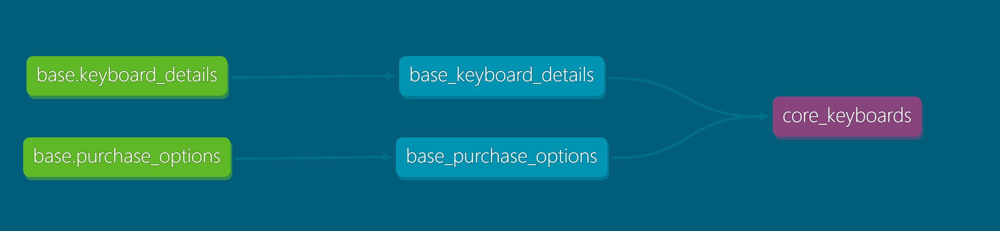
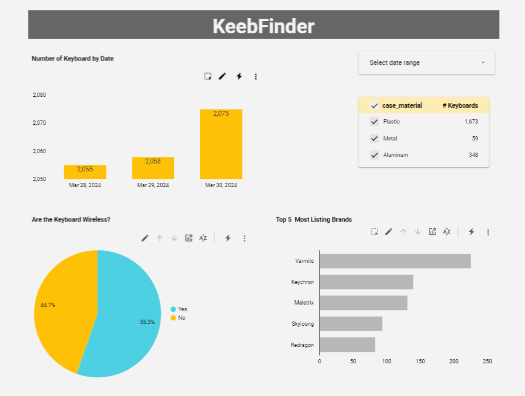
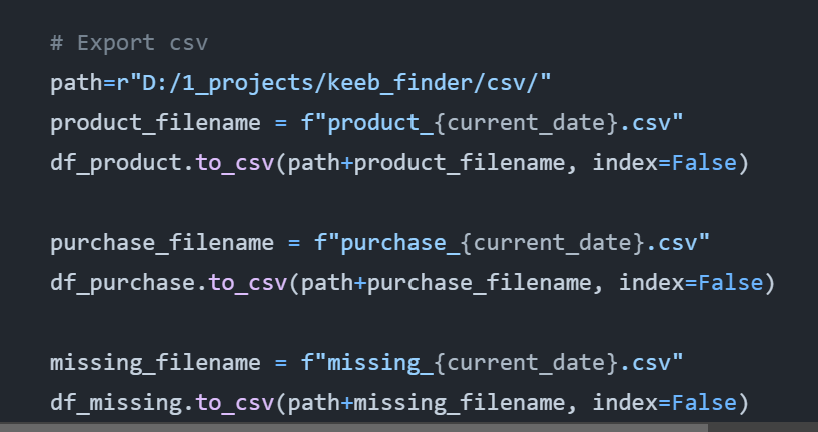

# Purpose
I took interested in mechanical keyboards and saw a lot of discussion on social media about them. So many types of keybaords available now with different materials, layouts, size... I wonder how popular one type is over others, options and technical specification of the keyboard in selling now.

Keeb-finder is a good website for that. They have many keyboards listed and easy to scrape. For the seek of practicing, keyboard data was only scraped from Mar 28, 2024 to Mar 30, 2024 using a Python script [here](https://github.com/NgocHueLy/data_eng_keeb_finder/blob/main/keeb-finder-scraper-products.py). Hopefully this scraping will not be a burden for the site.

Disclaimer: Some keyboards will be missing because of bad url format, or missing info.

# Questions This Project Seeks to Answer
- How many keyboards listed over time 
- Wired/Wireless connection percentage
- Most common material of keyboard case
- Most popular keyboard brands

# Tech Stack
- [Python Script](https://github.com/NgocHueLy/data_eng_keeb_finder/blob/main/keeb-finder-scraper-products.py) to scrape keyboards tile and detail listing from [keeb-finder/com/keyboards](https://keeb-finder.com/keyboards)
- [GitHub](https://github.com/) repo for storing scraped data and the project
- [Google Cloud](https://console.cloud.google.com/?hl=en&project=dtc-de-course-412502) to use BigQuery as data warehouse. I haven't set up VM machine since my GCP free trial already ended.
- [Mage](https://www.mage.ai/) used to orchestrate and monitor pipeline
- [DBT Core](https://www.getdbt.com/) to transform data in BigQuery and prepare for visualization using SQL
- [Looker Studio](https://lookerstudio.google.com/) to visualize the transformed dataset
- [Pandas](https://pandas.pydata.org/) to import and transform dataset
- [Terraform](https://www.terraform.io/) for version control of our infrastructure
- [Docker](https://docker.io/) for Mage image. I also update dbt to latest version via Mage terminal as the original dbt version in Mage not working


# Pipeline Architecture

- Python script scrapes data from keeb-finder.com and exports them as csv files. These files then uploaded to GitHub for easier to work with Mage.
- Terraform is used to setup BigQuerry database.
- Project keeb-finder create in Mage and use to load and clean data from GitHub to BigQuery. 
- dbtCore also run inside Mage as dbt blocks to build and load models to BigQuery.
- Looker Studio is used to visualize the transformed dataset.

# Structure of Data Models

## Linear Graph


Model core-keyboards' structure check [csv here](core-keyboards-structure.csv)
- Table ```base.keyboard_details``` contains data scraped from category page and listing page Technical Specification table
- Table ```base.purchase_options``` contains data scraped from listing page Purchase Options table
- ```base_keyboard_details``` and ```base_purchase_options ``` are models for the above tables, transformed by renaming columns, adding new columns with CASE statement, applying correct data types, dropping uncessary columns
- ```core_keyboards``` are model that join the ```base_keyboard_details``` and ```base_purchase_options ``` by listing_link and scrapping date


# Dashboard Preview
View dashboard [here](https://lookerstudio.google.com/reporting/093cd60c-59a7-44e8-b1c1-97235457e8c9)



# Replication Steps

## Using Web Scraper
1. Check if you already have these these Python libraries ```urllib```, ```bs4```, ```pandas```, ```datetime```, ```re``` in Terminal with ```import library-name-here```. If not yet, please install them.

2. Open script and check the bottom rows, from ```#Export csv```

3. Replace the value in  ```path``` variable with your desired path
4. Run script

## Setup Terraform
Check [here](https://developer.hashicorp.com/terraform/tutorials/aws-get-started/install-cli) for instruction

## Setup Google Cloud
Check this video [here](https://youtu.be/c3ZppKdSG5A?t=212) for details
1. Create a google cloud account
2. Setup a new google cloud project
3. Create service account and give it the roles ```Storage Admin```, ```BigQuery Amin```
4. Download key as json file for this service account
5. Create BigQuery dataset, you might use [this Terraform file](terraform\gcp.tf) as reference, replace ```project```, ```dataset_id```, ```location``` according to your environment
6. Make sure these API are enable

| NAME                                | TITLE                         |
|-------------------------------------|-------------------------------|
| analyticshub.googleapis.com         | Analytics Hub API             |
| bigquery.googleapis.com             | BigQuery API                  |
| bigqueryconnection.googleapis.com   | BigQuery Connection API       |
| bigquerydatapolicy.googleapis.com   | BigQuery Data Policy API      |
| bigquerymigration.googleapis.com    | BigQuery Migration API        |
| bigqueryreservation.googleapis.com  | BigQuery Reservation API      |
| bigquerystorage.googleapis.com      | BigQuery Storage API          |
| cloudapis.googleapis.com            | Google Cloud APIs             |
| cloudresourcemanager.googleapis.com | Cloud Resource Manager API    |
| cloudtrace.googleapis.com           | Cloud Trace API               |
| dataform.googleapis.com             | Dataform API                  |
| dataplex.googleapis.com             | Cloud Dataplex API            |
| datastore.googleapis.com            | Cloud Datastore API           |
| logging.googleapis.com              | Cloud Logging API             |
| monitoring.googleapis.com           | Cloud Monitoring API          |
| servicemanagement.googleapis.com    | Service Management API        |
| serviceusage.googleapis.com         | Service Usage API             |
| sql-component.googleapis.com        | Cloud SQL                     |
| storage-api.googleapis.com          | Google Cloud Storage JSON API |
| storage-component.googleapis.com    | Cloud Storage                 |
| storage.googleapis.com              | Cloud Storage API             |


## Setup Mage with Docker and connect Mage with BigQuery
1. Install [Docker](https://docs.docker.com/get-docker/)
2. Clone this repo, go to ```mage-quickstart``` folder, run ```docker-compose up```
3. Upload your service account key to ```mage-quickstart\keeb-finder```
4. Update ```mage-quickstart\keeb-finder\io_config.yaml```, ```GOOGLE_SERVICE_ACC_KEY_FILEPATH: "/home/src/keeb-finder/your-key-file-name.json"```
5. In these 2 pipelines: ```ingest_products_github_to_bigquery```, ```ingest_purchase_options_github_to_bigquery```, Update Export to BigQuery blocks ```table_id``` according to your BigQuery setup

## Run dbt in Mage
1. Install [dbt Core](https://docs.getdbt.com/docs/core/installation-overview) and connect [dbt with BigQuery](https://docs.getdbt.com/docs/core/connect-data-platform/bigquery-setup)
2. Go to ```mage-quickstart\keeb-finder\keeb_finder_dbt\profiles.yml``` update ```keyfile``` values to your service account key location, ```project```, ```dataset```
3. Run ```dbt debug``` to check dbt connection
4. Go to ```mage-quickstart\keeb-finder\keeb_finder_dbt\models\base\schema.yml``` update sources configuration values according to your bigquery setting


## Setup Looker Studio
 Add data source from BigQuery/core-keyboards table

# Next Steps
- More automation with Mage, scape data with Mage and load to GCS instead of GitHub
- CI/CD run pipeline daily
- Dockerize Python environment for reproduction supporting
- Use variable with Terraform
